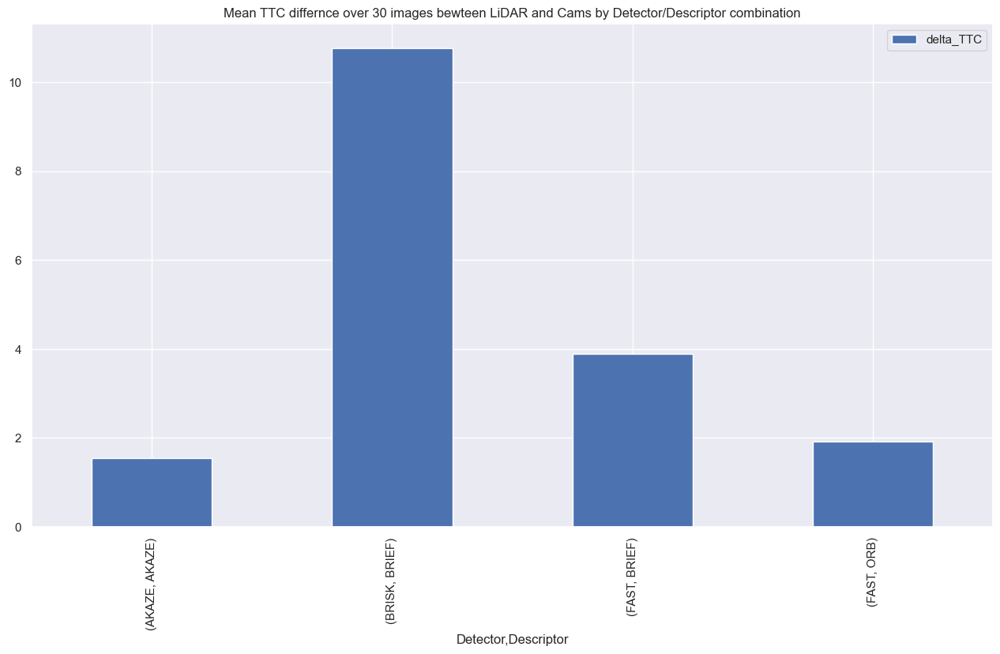

# SFND 3D Object Tracking

Welcome to the final project of the camera course. By completing all the lessons, you now have a solid understanding of keypoint detectors, descriptors, and methods to match them between successive images. Also, you know how to detect objects in an image using the YOLO deep-learning framework. And finally, you know how to associate regions in a camera image with Lidar points in 3D space. Let's take a look at our program schematic to see what we already have accomplished and what's still missing.


In this final project, you will implement the missing parts in the schematic. To do this, you will complete four major tasks: 
1. First, you will develop a way to match 3D objects over time by using keypoint correspondences. 
2. Second, you will compute the TTC based on Lidar measurements. 
3. You will then proceed to do the same using the camera, which requires to first associate keypoint matches to regions of interest and then to compute the TTC based on those matches. 
4. And lastly, you will conduct various tests with the framework. Your goal is to identify the most suitable detector/descriptor combination for TTC estimation and also to search for problems that can lead to faulty measurements by the camera or Lidar sensor. In the last course of this Nanodegree, you will learn about the Kalman filter, which is a great way to combine the two independent TTC measurements into an improved version which is much more reliable than a single sensor alone can be. But before we think about such things, let us focus on your final project in the camera course. 

## Dependencies for Running Locally
* cmake >= 2.8
  * All OSes: [click here for installation instructions](https://cmake.org/install/)
* make >= 4.1 (Linux, Mac), 3.81 (Windows)
  * Linux: make is installed by default on most Linux distros
  * Mac: [install Xcode command line tools to get make](https://developer.apple.com/xcode/features/)
  * Windows: [Click here for installation instructions](http://gnuwin32.sourceforge.net/packages/make.htm)
* Git LFS
  * Weight files are handled using [LFS](https://git-lfs.github.com/)
  * Install Git LFS before cloning this Repo.
* OpenCV >= 4.1
  * This must be compiled from source using the `-D OPENCV_ENABLE_NONFREE=ON` cmake flag for testing the SIFT and SURF detectors.
  * The OpenCV 4.1.0 source code can be found [here](https://github.com/opencv/opencv/tree/4.1.0)
* gcc/g++ >= 5.4
  * Linux: gcc / g++ is installed by default on most Linux distros
  * Mac: same deal as make - [install Xcode command line tools](https://developer.apple.com/xcode/features/)
  * Windows: recommend using [MinGW](http://www.mingw.org/)

## Basic Build Instructions

1. Clone this repo.
2. Make a build directory in the top level project directory: `mkdir build && cd build`
3. Compile: `cmake .. && make`
4. Run it: `./3D_object_tracking`.

## Project Tasks

### FP.1 - Match 3D obejcts

**Task**: please implement the method "matchBoundingBoxes", which takes as input both the previous and the current data frames and provides as output the ids of the matched regions of interest (i.e. the boxID property)“. Matches must be the ones with the highest number of keypoint correspondences.

### FP.2 - LiDAR based Time-to-Collision (TTC)

**TASK**: compute the time-to-collision for all matched 3D objects based on Lidar measurements alone. Please take a look at the "Lesson 3: Engineering a Collision Detection System" of this course to revisit the theory behind TTC estimation. Also, please implement the estimation in a way that makes it robust against outliers which might be way too close and thus lead to faulty estimates of the TTC. Please return your TCC to the main function at the end of computeTTCLidar.

**Implementation**
Pls. see camFusion_Student.cpp 
```
computeTTCLidar(std::vector<LidarPoint>& lidarPointsPrev, std::vector<LidarPoint>& lidarPointsCurr, double frameRate, double& TTC)
```

The line width was adjusted to 2.5 [m] like it is used in EUR.

The core function is to filter and extract from the current and previous LiDAR points the x_values that are within the road width.

```
// vector to store the distances x
    std::vector<double> x_values_prev, x_values_curr;

    // A lambda function filter_and_extract_x is used to encapsulate 
    // the common logic of filtering and extracting x-values
    auto filter_and_extract_x = [&](const std::vector<LidarPoint>& points, std::vector<double>& x_values) {
        for (const auto& point : points) {
            if (std::abs(point.y) <= lane_width / 2.0) {
                x_values.push_back(point.x);
            }
        }
        std::sort(x_values.begin(), x_values.end());
    };
```

After that a mean value for the TTC is calculated according to the simple constant velocity model.

```
    double x_median_prev = x_values_prev[x_values_prev.size() / 2];
    double x_median_curr = x_values_curr[x_values_curr.size() / 2];

    if (x_median_prev == x_median_curr) {
        TTC = NAN;
        std::cout << "TTC Lidar: NAN (medians are equal)" << std::endl;
        return;
    }

    TTC = x_median_curr * (1.0 / frameRate) / (x_median_prev - x_median_curr);  
```


### FP.3 - Associate Keypoint Correspondences with Bounding Boxes

**Task**: you need to find all keypoint matches that belong to each 3D object. You can do this by simply checking whether the corresponding keypoints are within the region of interest in the camera image. All matches which satisfy this condition should be added to a vector. The problem you will find is that there will be outliers among your matches. To eliminate those, I recommend that you compute a robust mean of all the euclidean distances between keypoint matches and then remove those that are too far away from the mean.

**Implementation**
Pls. see camFusion_Student.cpp 
```
void clusterKptMatchesWithROI(BoundingBox &boundingBox, std::vector<cv::KeyPoint> &kptsPrev, std::vector<cv::KeyPoint> &kptsCurr, std::vector<cv::DMatch> &kptMatches)
```

The core is the following code that ensures for all keypoint matches of the DMatrix are checked whether they are inside the bounding box. If so, a mean distance is calculated by sum up all individual diatnces div by the size of the introduced storage match matrix. A factor of 70% is introduced to reduce noise. Then all matches are checked against this new threshold and are kept if they are inside 70%-distance.

```
    // matrix to store the matches in the Dmatrix
    std::vector<cv::DMatch> matches;

    // Find the mean distance between all matched keypoints
    for(auto it = kptMatches.begin(); it != kptMatches.end(); ++it) {
        // internal keypoints
        cv::KeyPoint kpCurr = kptsCurr.at(it->trainIdx);
        cv::KeyPoint kpPrev = kptsPrev.at(it->queryIdx);

        if(boundingBox.roi.contains(kpCurr.pt)) {
            // store it to matches
            matches.push_back(*it);
            sum_distance += cv::norm(kpCurr.pt - kpPrev.pt);
        }
    }

    // Find the threshold distance
    double distMean = sum_distance / matches.size();
    double threshold = distMean * 0.7;
    
    // Find the matches that are within the threshold distance to filter out outliers
    for(auto it = matches.begin(); it != matches.end(); ++it) {
        cv::KeyPoint kpCurr = kptsCurr.at(it->trainIdx);
        cv::KeyPoint kpPrev = kptsPrev.at(it->queryIdx);

        if(cv::norm(kpCurr.pt - kpPrev.pt) < threshold) {
            // associates as a member of boundigBox
            boundingBox.kptMatches.push_back(*it);
        }
    }
```

### FP.4 - Camera based TTC

**TASK**: compute the TTC estimate

**Implementation**
Pls. see camFusion_Student.cpp 
```
void computeTTCCamera(std::vector<cv::KeyPoint>& kptsPrev, std::vector<cv::KeyPoint>& kptsCurr, std::vector<cv::DMatch> kptMatches, double frameRate, double& TTC) 
```

The core is to go over the DMatrix 2 times for previous and current frames and determine the distances of the respective keypoint in order to calculate a ratio that is used to analyze the median distance. Here a simple trick is applied that the median is in the middle of the vector indicies.

```
        // vectore to store the ratio of distances for eval
        std::vector<double> ratio_distances;

        double dist_min = 100.0;
        
        for (auto it1 = kptMatches.begin(); it1 != kptMatches.end() - 1; ++it1) {

            const cv::KeyPoint &prev_keypoint1 = kptsPrev[it1 -> queryIdx];
            const cv::KeyPoint &curr_keypoint1 = kptsCurr[it1 -> trainIdx];
            
            for (auto it2 = kptMatches.begin() + 1; it2 != kptMatches.end(); ++it2) {

                const cv::KeyPoint &prev_keypoint2 = kptsPrev[it2 -> queryIdx];
                const cv::KeyPoint &curr_keypoint2 = kptsCurr[it2 -> trainIdx];
                
                double prev_distance = cv::norm(prev_keypoint1.pt - prev_keypoint2.pt);
                double curr_distance = cv::norm(curr_keypoint1.pt - curr_keypoint2.pt);

                if (curr_distance > std::numeric_limits<double>::epsilon() && prev_distance >= dist_min) {
                    ratio_distances.push_back(curr_distance / prev_distance);
                }
            }
        }
```

Thus the TTC can be calculated due to the simple const velocity model:

```
        // Trick: sort the vector then find the median by middle index
        std::sort(ratio_distances.begin(), ratio_distances.end());
        long median_index = floor(ratio_distances.size() / 2);

        //std::cout << "Sorted Vector: " << ratio_distances.size() << std::endl;
        double median_distance_ratio;
            
        if (ratio_distances.size() % 2 == 0) {
            median_distance_ratio = (ratio_distances[median_index - 1] + ratio_distances[median_index]) / 2.0;
        } else {
            median_distance_ratio = ratio_distances[median_index];
        }
        // std::cout << "Median Ratio: "<< median_distance_ratio << std::endl;
            
        TTC = (-1.0 / frameRate) / (1 - median_distance_ratio);
```

### FP.4 - Evaluation

#### FP4.1 - Examples for non-plausible LiDAR TTCs

##### Example 1


 - here the issue seems there are still LiDAR points in the Box that have quite a different x-coordinate which means the mean value will be incorrectly shifted to larger ones.

  - **resolution** would be a better point filter

 ##### Example 2


 - here a negative value is calculated since x_median_curr must be bigger then the previous which is in situations of acceleration; **but** the breaking light is on and the traffic light is red

  - **resolution** would be a better point filter and refine a better model to calculate the TTC / not using const. velocity

**TASK**:

#### FP4.2 - Performance Evaluation Combonations

Criteria have not changed to the mid term project:

* reliability of the results/robustness of the chosen combination
* low method difference of the TTCs
* processing speed

Based on the mid term project I chose to limit myself to the combinations which were already fast and detected a huge amount of keypoints plus one "surprising combination" (=last one of the list): 

- FAST/BRIEF
- FAST/ORB
- BRISK/BRIEF
- AKAZE/AKAZE

All have used the Brute-Force (BF) method as matcher plus NN for nearest matching.

Individual tabular results can be investigated in the results folder inside results.md file.

An overview over the first 30 images is illustrated by the following 2 graphics out of which it can be seen that the LiDAR produces reliable results for those plus it computes a shorter TTC than cameras, although not huge difference overall. Reasoning is that the approach over the keypoints by frames is more indirect than using xyz-coordinates for calculation.

Also in the second graph the influence of the detector/ddescriptor combination clearly can be seen thus leaving BRISK behind. Chosing FAST or AKAZE as detector with its here analyzed combinations look fine.


